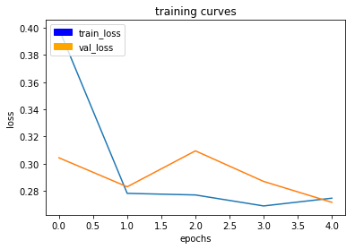
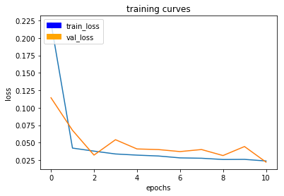
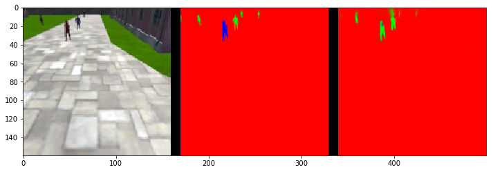
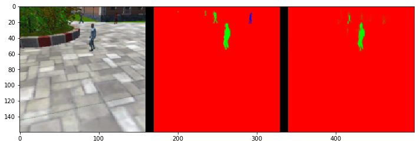
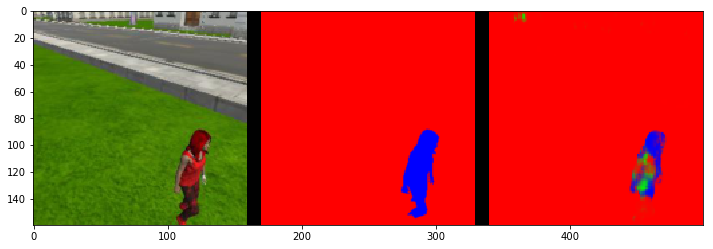
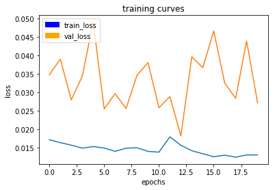

[](https://www.udacity.com/robotics)

## Deep Learning Project ##

In this project, you will train a deep neural network to identify and track a target in simulation. So-called “follow me” applications like this are key to many fields of robotics and the very same techniques you apply here could be extended to scenarios like advanced cruise control in autonomous vehicles or human-robot collaboration in industry.

[image_0]: ./docs/misc/sim_screenshot.png
![alt text][image_0] 

## Setup Instructions
**Clone the repository**
```
$ git clone https://github.com/udacity/RoboND-DeepLearning.git
```

**Download the data**

Save the following three files into the data folder of the cloned repository. 

[Training Data](https://s3-us-west-1.amazonaws.com/udacity-robotics/Deep+Learning+Data/Lab/train.zip) 

[Validation Data](https://s3-us-west-1.amazonaws.com/udacity-robotics/Deep+Learning+Data/Lab/validation.zip)

[Sample Evaluation Data](https://s3-us-west-1.amazonaws.com/udacity-robotics/Deep+Learning+Data/Project/sample_evaluation_data.zip)

**Download the QuadSim binary**

To interface your neural net with the QuadSim simulator, you must use a version QuadSim that has been custom tailored for this project. The previous version that you might have used for the Controls lab will not work.

The simulator binary can be downloaded [here](https://github.com/udacity/RoboND-DeepLearning/releases/latest)

**Install Dependencies**

You'll need Python 3 and Jupyter Notebooks installed to do this project.  The best way to get setup with these if you are not already is to use Anaconda following along with the [RoboND-Python-Starterkit](https://github.com/udacity/RoboND-Python-StarterKit).

If for some reason you choose not to use Anaconda, you must install the following frameworks and packages on your system:
* Python 3.x
* Tensorflow 1.2.1
* NumPy 1.11
* SciPy 0.17.0
* eventlet 
* Flask
* h5py
* PIL
* python-socketio
* scikit-image
* transforms3d
* PyQt4/Pyqt5

## Implement the Segmentation Network
1. Download the training dataset from above and extract to the project `data` directory.
2. Implement your solution in model_training.ipynb
3. Train the network locally, or on [AWS](https://classroom.udacity.com/nanodegrees/nd209/parts/09664d24-bdec-4e64-897a-d0f55e177f09/modules/cac27683-d5f4-40b4-82ce-d708de8f5373/lessons/197a058e-44f6-47df-8229-0ce633e0a2d0/concepts/27c73209-5d7b-4284-8315-c0e07a7cd87f?contentVersion=1.0.0&contentLocale=en-us).
4. Continue to experiment with the training data and network until you attain the score you desire.
5. Once you are comfortable with performance on the training dataset, see how it performs in live simulation!

## Collecting Training Data ##
A simple training dataset has been provided in this project's repository. This dataset will allow you to verify that your segmentation network is semi-functional. However, if your interested in improving your score,you may want to collect additional training data. To do it, please see the following steps.

The data directory is organized as follows:
```
data/runs - contains the results of prediction runs
data/train/images - contains images for the training set
data/train/masks - contains masked (labeled) images for the training set
data/validation/images - contains images for the validation set
data/validation/masks - contains masked (labeled) images for the validation set
data/weights - contains trained TensorFlow models

data/raw_sim_data/train/run1
data/raw_sim_data/validation/run1
```

### Training Set ###
1. Run QuadSim
2. Click the `DL Training` button
3. Set patrol points, path points, and spawn points. **TODO** add link to data collection doc
3. With the simulator running, press "r" to begin recording.
4. In the file selection menu navigate to the `data/raw_sim_data/train/run1` directory
5. **optional** to speed up data collection, press "9" (1-9 will slow down collection speed)
6. When you have finished collecting data, hit "r" to stop recording.
7. To reset the simulator, hit "`<esc>`"
8. To collect multiple runs create directories `data/raw_sim_data/train/run2`, `data/raw_sim_data/train/run3` and repeat the above steps.


### Validation Set ###
To collect the validation set, repeat both sets of steps above, except using the directory `data/raw_sim_data/validation` instead rather than `data/raw_sim_data/train`.

### Image Preprocessing ###
Before the network is trained, the images first need to be undergo a preprocessing step. The preprocessing step transforms the depth masks from the sim, into binary masks suitable for training a neural network. It also converts the images from .png to .jpeg to create a reduced sized dataset, suitable for uploading to AWS. 
To run preprocessing:
```
$ python preprocess_ims.py
```
**Note**: If your data is stored as suggested in the steps above, this script should run without error.

**Important Note 1:** 

Running `preprocess_ims.py` does *not* delete files in the processed_data folder. This means if you leave images in processed data and collect a new dataset, some of the data in processed_data will be overwritten some will be left as is. It is recommended to **delete** the train and validation folders inside processed_data(or the entire folder) before running `preprocess_ims.py` with a new set of collected data.

**Important Note 2:**

The notebook, and supporting code assume your data for training/validation is in data/train, and data/validation. After you run `preprocess_ims.py` you will have new `train`, and possibly `validation` folders in the `processed_ims`.
Rename or move `data/train`, and `data/validation`, then move `data/processed_ims/train`, into `data/`, and  `data/processed_ims/validation`also into `data/`

**Important Note 3:**

Merging multiple `train` or `validation` may be difficult, it is recommended that data choices be determined by what you include in `raw_sim_data/train/run1` with possibly many different runs in the directory. You can create a temporary folder in `data/` and store raw run data you don't currently want to use, but that may be useful for later. Choose which `run_x` folders to include in `raw_sim_data/train`, and `raw_sim_data/validation`, then run  `preprocess_ims.py` from within the 'code/' directory to generate your new training and validation sets. 


## Training, Predicting and Scoring ##
With your training and validation data having been generated or downloaded from the above section of this repository, you are free to begin working with the neural net.

**Note**: Training CNNs is a very compute-intensive process. If your system does not have a recent Nvidia graphics card, with [cuDNN](https://developer.nvidia.com/cudnn) and [CUDA](https://developer.nvidia.com/cuda) installed , you may need to perform the training step in the cloud. Instructions for using AWS to train your network in the cloud may be found [here](https://classroom.udacity.com/nanodegrees/nd209/parts/09664d24-bdec-4e64-897a-d0f55e177f09/modules/cac27683-d5f4-40b4-82ce-d708de8f5373/lessons/197a058e-44f6-47df-8229-0ce633e0a2d0/concepts/27c73209-5d7b-4284-8315-c0e07a7cd87f?contentVersion=1.0.0&contentLocale=en-us)

### Training your Model ###
**Prerequisites**
- Training data is in `data` directory
- Validation data is in the `data` directory
- The folders `data/train/images/`, `data/train/masks/`, `data/validation/images/`, and `data/validation/masks/` should exist and contain the appropriate data

To train complete the network definition in the `model_training.ipynb` notebook and then run the training cell with appropriate hyperparameters selected.

After the training run has completed, your model will be stored in the `data/weights` directory as an [HDF5](https://en.wikipedia.org/wiki/Hierarchical_Data_Format) file, and a configuration_weights file. As long as they are both in the same location, things should work. 

**Important Note** the *validation* directory is used to store data that will be used during training to produce the plots of the loss, and help determine when the network is overfitting your data. 

The **sample_evalution_data** directory contains data specifically designed to test the networks performance on the FollowME task. In sample_evaluation data are three directories each generated using a different sampling method. The structure of these directories is exactly the same as `validation`, and `train` datasets provided to you. For instance `patrol_with_targ` contains an `images` and `masks` subdirectory. If you would like to the evaluation code on your `validation` data a copy of the it should be moved into `sample_evaluation_data`, and then the appropriate arguments changed to the function calls in the `model_training.ipynb` notebook.

The notebook has examples of how to evaulate your model once you finish training. Think about the sourcing methods, and how the information provided in the evaluation sections relates to the final score. Then try things out that seem like they may work. 

## Scoring ##

To score the network on the Follow Me task, two types of error are measured. First the intersection over the union for the pixelwise classifications is computed for the target channel. 

In addition to this we determine whether the network detected the target person or not. If more then 3 pixels have probability greater then 0.5 of being the target person then this counts as the network guessing the target is in the image. 

We determine whether the target is actually in the image by whether there are more then 3 pixels containing the target in the label mask. 

Using the above the number of detection true_positives, false positives, false negatives are counted. 

**How the Final score is Calculated**

The final score is the pixelwise `average_IoU*(n_true_positive/(n_true_positive+n_false_positive+n_false_negative))` on data similar to that provided in sample_evaulation_data

**Ideas for Improving your Score**

Collect more data from the sim. Look at the predictions think about what the network is getting wrong, then collect data to counteract this. Or improve your network architecture and hyperparameters. 

**Obtaining a Leaderboard Score**

Share your scores in slack, and keep a tally in a pinned message. Scores should be computed on the sample_evaluation_data. This is for fun, your grade will be determined on unreleased data. If you use the sample_evaluation_data to train the network, it will result in inflated scores, and you will not be able to determine how your network will actually perform when evaluated to determine your grade.

## Experimentation: Testing in Simulation
1. Copy your saved model to the weights directory `data/weights`.
2. Launch the simulator, select "Spawn People", and then click the "Follow Me" button.
3. Run the realtime follower script
```
$ python follower.py model_weights
```

**Note:** If you'd like to see an overlay of the detected region on each camera frame from the drone, simply pass the `--pred_viz` parameter to `follower.py`

## Model Documentation (the Write-Up) ##

### Setup #1:

Model summary:

```
Layer (type)                     Output Shape          Param #     Connected to                     
====================================================================================================
input_1 (InputLayer)             (None, 160, 160, 3)   0                                            
____________________________________________________________________________________________________
separable_conv2d_1 (SeparableCon (None, 80, 80, 64)    283         input_1[0][0]                    
____________________________________________________________________________________________________
batch_normalization_1 (BatchNorm (None, 80, 80, 64)    256         separable_conv2d_1[0][0]         
____________________________________________________________________________________________________
separable_conv2d_2 (SeparableCon (None, 40, 40, 128)   8896        batch_normalization_1[0][0]      
____________________________________________________________________________________________________
batch_normalization_2 (BatchNorm (None, 40, 40, 128)   512         separable_conv2d_2[0][0]         
____________________________________________________________________________________________________
separable_conv2d_3 (SeparableCon (None, 20, 20, 128)   17664       batch_normalization_2[0][0]      
____________________________________________________________________________________________________
batch_normalization_3 (BatchNorm (None, 20, 20, 128)   512         separable_conv2d_3[0][0]         
____________________________________________________________________________________________________
conv2d_1 (Conv2D)                (None, 20, 20, 64)    73792       batch_normalization_3[0][0]      
____________________________________________________________________________________________________
batch_normalization_4 (BatchNorm (None, 20, 20, 64)    256         conv2d_1[0][0]                   
____________________________________________________________________________________________________
up_sampling2d_1 (UpSampling2D)   (None, 40, 40, 64)    0           batch_normalization_4[0][0]      
____________________________________________________________________________________________________
concatenate_1 (Concatenate)      (None, 40, 40, 192)   0           up_sampling2d_1[0][0]            
                                                                   batch_normalization_2[0][0]      
____________________________________________________________________________________________________
separable_conv2d_4 (SeparableCon (None, 40, 40, 128)   26432       concatenate_1[0][0]              
____________________________________________________________________________________________________
batch_normalization_5 (BatchNorm (None, 40, 40, 128)   512         separable_conv2d_4[0][0]         
____________________________________________________________________________________________________
separable_conv2d_5 (SeparableCon (None, 40, 40, 128)   17664       batch_normalization_5[0][0]      
____________________________________________________________________________________________________
batch_normalization_6 (BatchNorm (None, 40, 40, 128)   512         separable_conv2d_5[0][0]         
____________________________________________________________________________________________________
up_sampling2d_2 (UpSampling2D)   (None, 80, 80, 128)   0           batch_normalization_6[0][0]      
____________________________________________________________________________________________________
concatenate_2 (Concatenate)      (None, 80, 80, 192)   0           up_sampling2d_2[0][0]            
                                                                   batch_normalization_1[0][0]      
____________________________________________________________________________________________________
separable_conv2d_6 (SeparableCon (None, 80, 80, 128)   26432       concatenate_2[0][0]              
____________________________________________________________________________________________________
batch_normalization_7 (BatchNorm (None, 80, 80, 128)   512         separable_conv2d_6[0][0]         
____________________________________________________________________________________________________
separable_conv2d_7 (SeparableCon (None, 80, 80, 128)   17664       batch_normalization_7[0][0]      
____________________________________________________________________________________________________
batch_normalization_8 (BatchNorm (None, 80, 80, 128)   512         separable_conv2d_7[0][0]         
____________________________________________________________________________________________________
up_sampling2d_3 (UpSampling2D)   (None, 160, 160, 128) 0           batch_normalization_8[0][0]      
____________________________________________________________________________________________________
conv2d_2 (Conv2D)                (None, 160, 160, 3)   3459        up_sampling2d_3[0][0]            
====================================================================================================
Total params: 195,870
Trainable params: 194,078
Non-trainable params: 1,792
____________________________________________________________________________________________________
```

#### Explanation of the network


The network uses three downsampling encoders by using Separable Convolution layer with a stride of 2x2, followed by batch normalization between the layers. Batch normalization is useful to ensure that the model is able to learn *the model* of a distribution instead of the distribution itself. [This article](https://gab41.lab41.org/batch-normalization-what-the-hey-d480039a9e3b) explained this concept in a really good analogy:

> For example, let’s say I’m hungry while I’m working. Everyday, Jane brings in Mac ‘n Cheese Hamburgers and Carrot Burgers. Also let’s say that Carrot Burgers look somewhat like Mac ‘n Cheese Burgers. Ted has never been exposed to Mac ‘n Cheese Hamburgers, so yesterday, I took him into the breakroom and point them out by describing them so that he can attempt to learn a function Ps(Y | X), the probability of Y being a Mac ‘n Cheese Burger given the features X. Here X are my descriptions like color, smell, etc. Essentially, I’ve trained Ted on a set of burgers S = { (X0, Y0), (X1, Y1), … } to recognize which Y burger to get, based on what Mac ‘n Cheese burgers look like, X.

> Today, I’m busy, so I ask Ted to go get me a M&C burger. Since he knows what P (Y | X) is (or at least he thinks he does), I’m confident that although I know carrots are good for me, I won’t be eating them for lunch. Trouble is, Jane went to a different store today to pick up Mac ‘n Cheese & Carrot Burgers. Let’s call this set of burgers T, and the burgers in T look different than the original set of burgers S. Naturally Ted’s confused, even though he knows P (Y | X) = Ps(Y | X) = PT(Y | X). Why is he confused? Because Ps(X) ≠ PT(X): the source distribution is different than the target distribution. The ketchup is darker, the buns are lighter, and so on. In short, the feature space of T is drastically different than S, which was what was used in training.

> Why does this matter? A great little explanation is here, but the general idea is that we’re not actually learning P(Y | X), but rather, the model of P(Y | X, θ), where θ are the parameters of that model. And since often times it’s difficult to specify the right model for a phenomenon (for deep learning, we’re pretty sure it’s never the right model), the distribution of the input, i.e. P(X), is important. To correct for the shift, a fix could be to re-train with points in S by weighting by PT(X) / Ps(X), or the perceived true distribution. 

At the end of the downsampling layers, the network is then connected to a Fully Connected layer that is a one by one convolution with dimensional reduction to 64 filters (from the 128 filters in the input layer).

And finally, it is then followed by three upsampling decoders implemented using bilinear upsampling with skip connections from the encoders between them. Within each decoder, two additional separable convolution layers were added to extract some more spatial information from prior layers.

The network is topped by an additional one by one convolutions to reduce depth after concatenation and introduce additional non-linearities.


Hyperparameters:

```
learning_rate = 0.1
batch_size = 64
num_epochs = 5
steps_per_epoch = 200
validation_steps = 50
```

Training Curves:



Score Weight: 0.636568848758465
Final IoU: 0.319308355432
Final Score: 0.203261752217


### Setup #2:

I tried increasing the epochs to 8 and lowering the learning rate to 0.001 and batch size to 32, but the final score did not get higher than 0.25. I then decided to shrink the model and adding more epochs which improved the result.

Model Summary:

```
____________________________________________________________________________________________________
Layer (type)                     Output Shape          Param #     Connected to                     
====================================================================================================
input_2 (InputLayer)             (None, 160, 160, 3)   0                                            
____________________________________________________________________________________________________
separable_conv2d_8 (SeparableCon (None, 80, 80, 64)    283         input_2[0][0]                    
____________________________________________________________________________________________________
batch_normalization_9 (BatchNorm (None, 80, 80, 64)    256         separable_conv2d_8[0][0]         
____________________________________________________________________________________________________
separable_conv2d_9 (SeparableCon (None, 40, 40, 128)   8896        batch_normalization_9[0][0]      
____________________________________________________________________________________________________
batch_normalization_10 (BatchNor (None, 40, 40, 128)   512         separable_conv2d_9[0][0]         
____________________________________________________________________________________________________
separable_conv2d_10 (SeparableCo (None, 20, 20, 128)   17664       batch_normalization_10[0][0]     
____________________________________________________________________________________________________
batch_normalization_11 (BatchNor (None, 20, 20, 128)   512         separable_conv2d_10[0][0]        
____________________________________________________________________________________________________
conv2d_3 (Conv2D)                (None, 20, 20, 64)    73792       batch_normalization_11[0][0]     
____________________________________________________________________________________________________
batch_normalization_12 (BatchNor (None, 20, 20, 64)    256         conv2d_3[0][0]                   
____________________________________________________________________________________________________
up_sampling2d_4 (UpSampling2D)   (None, 40, 40, 64)    0           batch_normalization_12[0][0]     
____________________________________________________________________________________________________
concatenate_3 (Concatenate)      (None, 40, 40, 192)   0           up_sampling2d_4[0][0]            
                                                                   batch_normalization_10[0][0]     
____________________________________________________________________________________________________
separable_conv2d_11 (SeparableCo (None, 40, 40, 128)   26432       concatenate_3[0][0]              
____________________________________________________________________________________________________
batch_normalization_13 (BatchNor (None, 40, 40, 128)   512         separable_conv2d_11[0][0]        
____________________________________________________________________________________________________
up_sampling2d_5 (UpSampling2D)   (None, 80, 80, 128)   0           batch_normalization_13[0][0]     
____________________________________________________________________________________________________
concatenate_4 (Concatenate)      (None, 80, 80, 192)   0           up_sampling2d_5[0][0]            
                                                                   batch_normalization_9[0][0]      
____________________________________________________________________________________________________
separable_conv2d_12 (SeparableCo (None, 80, 80, 128)   26432       concatenate_4[0][0]              
____________________________________________________________________________________________________
batch_normalization_14 (BatchNor (None, 80, 80, 128)   512         separable_conv2d_12[0][0]        
____________________________________________________________________________________________________
up_sampling2d_6 (UpSampling2D)   (None, 160, 160, 128) 0           batch_normalization_14[0][0]     
____________________________________________________________________________________________________
conv2d_4 (Conv2D)                (None, 160, 160, 3)   3459        up_sampling2d_6[0][0]            
====================================================================================================
Total params: 159,518
Trainable params: 158,238
Non-trainable params: 1,280
____________________________________________________________________________________________________
```

Hyperparameters:

```
learning_rate = 0.001
batch_size = 32
num_epochs = 20
steps_per_epoch = 200
validation_steps = 50
```

Training Curves:


Score Weight: 0.7134767836919592
Final IoU: 0.498557391726
Final Score: 0.355709124334

### Setup #3:

Reducing the number of parameters further (by removing both `separable_conv2d_batchnorm(output_layer, filters)` from `decoder_block()`) lowers the final score down to 0.267, so I reverted back to the previous model.

I found that the validation loss stopped decreasing after 10-11 epochs, so I set the number of epochs to 11. I have also lowered down the number of batch size which should improve the scores a bit as a trade off to increased training time. The number of steps per epochs is adjusted by `[number of training data] / batch_size` (we have 4131 training data in this case).

Hyperparameters:

```
learning_rate = 0.001
batch_size = 16
num_epochs = 11
steps_per_epoch = 200
validation_steps = 50
```

Training Curves:



Score Weight: 0.7119021134593994
Final IoU: 0.506876760286
Final Score: 0.360846636911

I think this is as good as the model gets without adding more data points. In the next section, we will look into this improvement.

### Adding More Data points

Looking at some of the results, it looks like the model had difficulties when trying to find the hero while patroling:


 


The model was not able to find the hero when she is too far away, even when there were no other people, as shown here:
 
 

#### Cheating

I admit that I cheated a bit in collecting the data points. I printed out most of the `patrol_with_targ` evaluation results and added specific examples to improve the scores. For example, here are what I did:

- I noticed that most images were taken at the paved road so I recorded many images from that area.
- I set the drone to look at an exact scene then emulated an exact scene. This had resulted in a good prediction in that particular scene. Here is the scene in question:
  

### Setup #4 (Final model):

I added about 1,000 new training data, but the final score did not get higher than 4.0. A more complex model would support a larger number of data points, so I increased the model complexity by adding another Separation Convolution Layer, which reverted the model back to the first model that I tried above:

```
____________________________________________________________________________________________________
Layer (type)                     Output Shape          Param #     Connected to                     
====================================================================================================
input_2 (InputLayer)             (None, 160, 160, 3)   0                                            
____________________________________________________________________________________________________
separable_conv2d_6 (SeparableCon (None, 80, 80, 64)    283         input_2[0][0]                    
____________________________________________________________________________________________________
batch_normalization_7 (BatchNorm (None, 80, 80, 64)    256         separable_conv2d_6[0][0]         
____________________________________________________________________________________________________
separable_conv2d_7 (SeparableCon (None, 40, 40, 128)   8896        batch_normalization_7[0][0]      
____________________________________________________________________________________________________
batch_normalization_8 (BatchNorm (None, 40, 40, 128)   512         separable_conv2d_7[0][0]         
____________________________________________________________________________________________________
separable_conv2d_8 (SeparableCon (None, 20, 20, 128)   17664       batch_normalization_8[0][0]      
____________________________________________________________________________________________________
batch_normalization_9 (BatchNorm (None, 20, 20, 128)   512         separable_conv2d_8[0][0]         
____________________________________________________________________________________________________
conv2d_3 (Conv2D)                (None, 20, 20, 64)    73792       batch_normalization_9[0][0]      
____________________________________________________________________________________________________
batch_normalization_10 (BatchNor (None, 20, 20, 64)    256         conv2d_3[0][0]                   
____________________________________________________________________________________________________
up_sampling2d_4 (UpSampling2D)   (None, 40, 40, 64)    0           batch_normalization_10[0][0]     
____________________________________________________________________________________________________
concatenate_3 (Concatenate)      (None, 40, 40, 192)   0           up_sampling2d_4[0][0]            
                                                                   batch_normalization_8[0][0]      
____________________________________________________________________________________________________
separable_conv2d_9 (SeparableCon (None, 40, 40, 128)   26432       concatenate_3[0][0]              
____________________________________________________________________________________________________
batch_normalization_11 (BatchNor (None, 40, 40, 128)   512         separable_conv2d_9[0][0]         
____________________________________________________________________________________________________
separable_conv2d_10 (SeparableCo (None, 40, 40, 128)   17664       batch_normalization_11[0][0]     
____________________________________________________________________________________________________
batch_normalization_12 (BatchNor (None, 40, 40, 128)   512         separable_conv2d_10[0][0]        
____________________________________________________________________________________________________
up_sampling2d_5 (UpSampling2D)   (None, 80, 80, 128)   0           batch_normalization_12[0][0]     
____________________________________________________________________________________________________
concatenate_4 (Concatenate)      (None, 80, 80, 192)   0           up_sampling2d_5[0][0]            
                                                                   batch_normalization_7[0][0]      
____________________________________________________________________________________________________
separable_conv2d_11 (SeparableCo (None, 80, 80, 128)   26432       concatenate_4[0][0]              
____________________________________________________________________________________________________
batch_normalization_13 (BatchNor (None, 80, 80, 128)   512         separable_conv2d_11[0][0]        
____________________________________________________________________________________________________
separable_conv2d_12 (SeparableCo (None, 80, 80, 128)   17664       batch_normalization_13[0][0]     
____________________________________________________________________________________________________
batch_normalization_14 (BatchNor (None, 80, 80, 128)   512         separable_conv2d_12[0][0]        
____________________________________________________________________________________________________
up_sampling2d_6 (UpSampling2D)   (None, 160, 160, 128) 0           batch_normalization_14[0][0]     
____________________________________________________________________________________________________
conv2d_4 (Conv2D)                (None, 160, 160, 3)   3459        up_sampling2d_6[0][0]            
====================================================================================================
Total params: 195,870
Trainable params: 194,078
Non-trainable params: 1,792
____________________________________________________________________________________________________
```

With the following hyperparameters:

```
learning_rate = 0.001
batch_size = 16
num_epochs = 20
steps_per_epoch = 350
validation_steps = 50
```

The validation curve did not look promising:



But the training curve was lower than previous trainings. This is okay; I did not add any validation data from the newly added images, so it was kind of expected that the validation loss behaved erratically.

The evaluation score had gotten higher than the required 0.4 score, however, so I am quite happy with the result:

Score Weight: 0.73
Final IoU: 0.549231793833
Final Score: 0.400939209498

And finally, the drone was able to follow our hero!


### Potential Improvement to The Network

A possible potential improvement to the network can be done by doing a more appropriate validation process. One that comes to mind is by updating the `preprocess_ims.py` script to split the produced data into training and validation sets. A k-fold cross-validation technique might also be useful here to avoid overfitting.

With a more proper validation step, early stopping callback would also be useful. It is not currently useful since the validation scores do not well reflect test performances.