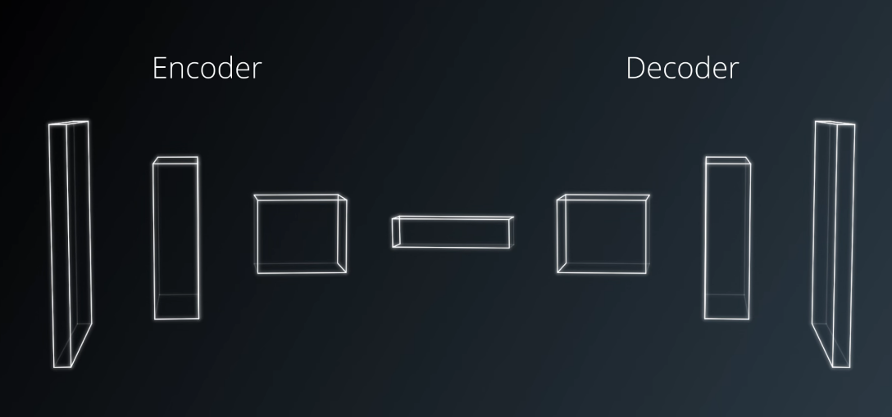
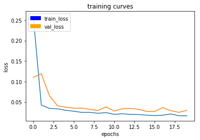

# Model Documentation (the Write-Up) #

> Note for reviewer:

> I have updated the code to work with Tensorflow 1.4.0 + Keras 2.0.8.
> To use Udacity's recommended (older) environment, please update Python scripts
> inside the `code` directory (I have commented out relevant changes that are required).

## Final Model Description ##


### Explanation of the network

The network uses three downsampling encoders by using Separable Convolution layer with a stride of 2x2, followed by batch normalization between the layers.

At the end of the downsampling layers, the network is then connected to a Fully Connected layer that is a one by one convolution with dimensional reduction to 64 filters (from the 128 filters in the input layer).

And finally, it is then followed by three upsampling decoders implemented using bilinear upsampling with skip connections from the encoders between them. Within each decoder, two additional separable convolution layers (followed by batch normalization for each of them) were added to extract some more spatial information from prior layers.

The network is topped by an additional one by one convolution to reduce depth after concatenation and introduce additional non-linearities.

#### What is the difference between a Separable Convolution Layer and a standard Convolution Layers?

An usual convolution has n filters. Each filter has m kernels, where m is the number of input channels and each kernel corresponds to an input channel. The 2d convolution is performed between each kernel and its corresponding channel and then they’re summed up across the channels to produce a single output channel. N filters will lead to n channels.

But this requires m x kernel_size parameters for each filter. By contrast, depthwise separable convolutions perform a depthwise convolution followed by a pointwise (one by one) convolution.

In a depthwise convolution, the kernels of each filter are applied separately to each channel and the outputs are concatenated. Then, the pointwise convolution is applied.

As you can see, this factors the dimensions between the 2D and the depth. This greatly reduces the number of parameters that are required while still keeping efficiency and not destroying cross-channel features.

#### What is the difference between One on One Convolution Layer and a Fully Connected Layer?

The main use of one-by-one convolutions in this project is to connect encoder part of the network to the decoder part of the network. It is the same as 2-d convolution with kernel size of 1. One of the nice features of one-by-one convolution is that it preserves spatial information such as the classified pixels can be overlaid on the original pixels. Another benefit of one-by-one transofrmation is reducing the number of filters (depth) going down the network.

A Fully Connected Layer, on the other hand, is just a standard neural network layer, where each neuron connects to all neurons in the previous layer (hence the name Fully Connected). This layer is generally used as the last layer of a deep neural network that outputs the prediction result.

#### Why do we have encoder and decoder blocks?



The encoder portion is a convolution network that reduces to a deeper 1x1 convolution layer, in contrast to a flat fully connected layer that would be used for basic classification of images. This difference has the effect of preserving spatial information from the image.

The decoder blocks, on the other hand, are used to convert the layers to higher dimensions or resolutions. In this project's case, it is used so we may extract our segmentation result. As you see in the final model diagram at the top of this document, the decoders contain bilinear upsampling layers for this purpose.

Let's consider the scenario where you have 4 known pixel values, so essentially a 2x2 grayscale image. This image is required to be upsampled to a 4x4 image. The following image gives a better idea of this process.


The unmarked pixels shown in the 4x4 illustration above are essentially whitespace. The bilinear upsampling method will try to fill out all the remaining pixel values via interpolation. Consider the case of P5 to understand this algorithm.

#### What is Batch Normalization?

Batch normalization is useful to ensure that the model is able to learn *the model* of a distribution instead of the distribution itself. [This article](https://gab41.lab41.org/batch-normalization-what-the-hey-d480039a9e3b) explained this concept in a really good analogy:

> For example, let’s say I’m hungry while I’m working. Everyday, Jane brings in Mac ‘n Cheese Hamburgers and Carrot Burgers. Also let’s say that Carrot Burgers look somewhat like Mac ‘n Cheese Burgers. Ted has never been exposed to Mac ‘n Cheese Hamburgers, so yesterday, I took him into the breakroom and point them out by describing them so that he can attempt to learn a function Ps(Y | X), the probability of Y being a Mac ‘n Cheese Burger given the features X. Here X are my descriptions like color, smell, etc. Essentially, I’ve trained Ted on a set of burgers S = { (X0, Y0), (X1, Y1), … } to recognize which Y burger to get, based on what Mac ‘n Cheese burgers look like, X.

> Today, I’m busy, so I ask Ted to go get me a M&C burger. Since he knows what P (Y | X) is (or at least he thinks he does), I’m confident that although I know carrots are good for me, I won’t be eating them for lunch. Trouble is, Jane went to a different store today to pick up Mac ‘n Cheese & Carrot Burgers. Let’s call this set of burgers T, and the burgers in T look different than the original set of burgers S. Naturally Ted’s confused, even though he knows P (Y | X) = Ps(Y | X) = PT(Y | X). Why is he confused? Because Ps(X) ≠ PT(X): the source distribution is different than the target distribution. The ketchup is darker, the buns are lighter, and so on. In short, the feature space of T is drastically different than S, which was what was used in training.

> Why does this matter? A great little explanation is here, but the general idea is that we’re not actually learning P(Y | X), but rather, the model of P(Y | X, θ), where θ are the parameters of that model. And since often times it’s difficult to specify the right model for a phenomenon (for deep learning, we’re pretty sure it’s never the right model), the distribution of the input, i.e. P(X), is important. To correct for the shift, a fix could be to re-train with points in S by weighting by PT(X) / Ps(X), or the perceived true distribution. 

## Experiments ##

### Setup #1:

Model summary:

```
Layer (type)                     Output Shape          Param #     Connected to                     
====================================================================================================
input_1 (InputLayer)             (None, 160, 160, 3)   0                                            
____________________________________________________________________________________________________
separable_conv2d_1 (SeparableCon (None, 80, 80, 64)    283         input_1[0][0]                    
____________________________________________________________________________________________________
batch_normalization_1 (BatchNorm (None, 80, 80, 64)    256         separable_conv2d_1[0][0]         
____________________________________________________________________________________________________
separable_conv2d_2 (SeparableCon (None, 40, 40, 128)   8896        batch_normalization_1[0][0]      
____________________________________________________________________________________________________
batch_normalization_2 (BatchNorm (None, 40, 40, 128)   512         separable_conv2d_2[0][0]         
____________________________________________________________________________________________________
separable_conv2d_3 (SeparableCon (None, 20, 20, 128)   17664       batch_normalization_2[0][0]      
____________________________________________________________________________________________________
batch_normalization_3 (BatchNorm (None, 20, 20, 128)   512         separable_conv2d_3[0][0]         
____________________________________________________________________________________________________
conv2d_1 (Conv2D)                (None, 20, 20, 64)    73792       batch_normalization_3[0][0]      
____________________________________________________________________________________________________
batch_normalization_4 (BatchNorm (None, 20, 20, 64)    256         conv2d_1[0][0]                   
____________________________________________________________________________________________________
up_sampling2d_1 (UpSampling2D)   (None, 40, 40, 64)    0           batch_normalization_4[0][0]      
____________________________________________________________________________________________________
concatenate_1 (Concatenate)      (None, 40, 40, 192)   0           up_sampling2d_1[0][0]            
                                                                   batch_normalization_2[0][0]      
____________________________________________________________________________________________________
separable_conv2d_4 (SeparableCon (None, 40, 40, 128)   26432       concatenate_1[0][0]              
____________________________________________________________________________________________________
batch_normalization_5 (BatchNorm (None, 40, 40, 128)   512         separable_conv2d_4[0][0]         
____________________________________________________________________________________________________
separable_conv2d_5 (SeparableCon (None, 40, 40, 128)   17664       batch_normalization_5[0][0]      
____________________________________________________________________________________________________
batch_normalization_6 (BatchNorm (None, 40, 40, 128)   512         separable_conv2d_5[0][0]         
____________________________________________________________________________________________________
up_sampling2d_2 (UpSampling2D)   (None, 80, 80, 128)   0           batch_normalization_6[0][0]      
____________________________________________________________________________________________________
concatenate_2 (Concatenate)      (None, 80, 80, 192)   0           up_sampling2d_2[0][0]            
                                                                   batch_normalization_1[0][0]      
____________________________________________________________________________________________________
separable_conv2d_6 (SeparableCon (None, 80, 80, 128)   26432       concatenate_2[0][0]              
____________________________________________________________________________________________________
batch_normalization_7 (BatchNorm (None, 80, 80, 128)   512         separable_conv2d_6[0][0]         
____________________________________________________________________________________________________
separable_conv2d_7 (SeparableCon (None, 80, 80, 128)   17664       batch_normalization_7[0][0]      
____________________________________________________________________________________________________
batch_normalization_8 (BatchNorm (None, 80, 80, 128)   512         separable_conv2d_7[0][0]         
____________________________________________________________________________________________________
up_sampling2d_3 (UpSampling2D)   (None, 160, 160, 128) 0           batch_normalization_8[0][0]      
____________________________________________________________________________________________________
conv2d_2 (Conv2D)                (None, 160, 160, 3)   3459        up_sampling2d_3[0][0]            
====================================================================================================
Total params: 195,870
Trainable params: 194,078
Non-trainable params: 1,792
____________________________________________________________________________________________________
```


Hyperparameters:

```
learning_rate = 0.1
batch_size = 64
num_epochs = 5
steps_per_epoch = 200
validation_steps = 50
```

Training Curves:


Score Weight: 0.636568848758465
Final IoU: 0.319308355432
Final Score: 0.203261752217


### Setup #2:

I tried increasing the epochs to 8 and lowering the learning rate to 0.001 and batch size to 32, but the final score did not get higher than 0.25. I then decided to shrink the model and adding more epochs which improved the result.

Model Summary:

```
____________________________________________________________________________________________________
Layer (type)                     Output Shape          Param #     Connected to                     
====================================================================================================
input_2 (InputLayer)             (None, 160, 160, 3)   0                                            
____________________________________________________________________________________________________
separable_conv2d_8 (SeparableCon (None, 80, 80, 64)    283         input_2[0][0]                    
____________________________________________________________________________________________________
batch_normalization_9 (BatchNorm (None, 80, 80, 64)    256         separable_conv2d_8[0][0]         
____________________________________________________________________________________________________
separable_conv2d_9 (SeparableCon (None, 40, 40, 128)   8896        batch_normalization_9[0][0]      
____________________________________________________________________________________________________
batch_normalization_10 (BatchNor (None, 40, 40, 128)   512         separable_conv2d_9[0][0]         
____________________________________________________________________________________________________
separable_conv2d_10 (SeparableCo (None, 20, 20, 128)   17664       batch_normalization_10[0][0]     
____________________________________________________________________________________________________
batch_normalization_11 (BatchNor (None, 20, 20, 128)   512         separable_conv2d_10[0][0]        
____________________________________________________________________________________________________
conv2d_3 (Conv2D)                (None, 20, 20, 64)    73792       batch_normalization_11[0][0]     
____________________________________________________________________________________________________
batch_normalization_12 (BatchNor (None, 20, 20, 64)    256         conv2d_3[0][0]                   
____________________________________________________________________________________________________
up_sampling2d_4 (UpSampling2D)   (None, 40, 40, 64)    0           batch_normalization_12[0][0]     
____________________________________________________________________________________________________
concatenate_3 (Concatenate)      (None, 40, 40, 192)   0           up_sampling2d_4[0][0]            
                                                                   batch_normalization_10[0][0]     
____________________________________________________________________________________________________
separable_conv2d_11 (SeparableCo (None, 40, 40, 128)   26432       concatenate_3[0][0]              
____________________________________________________________________________________________________
batch_normalization_13 (BatchNor (None, 40, 40, 128)   512         separable_conv2d_11[0][0]        
____________________________________________________________________________________________________
up_sampling2d_5 (UpSampling2D)   (None, 80, 80, 128)   0           batch_normalization_13[0][0]     
____________________________________________________________________________________________________
concatenate_4 (Concatenate)      (None, 80, 80, 192)   0           up_sampling2d_5[0][0]            
                                                                   batch_normalization_9[0][0]      
____________________________________________________________________________________________________
separable_conv2d_12 (SeparableCo (None, 80, 80, 128)   26432       concatenate_4[0][0]              
____________________________________________________________________________________________________
batch_normalization_14 (BatchNor (None, 80, 80, 128)   512         separable_conv2d_12[0][0]        
____________________________________________________________________________________________________
up_sampling2d_6 (UpSampling2D)   (None, 160, 160, 128) 0           batch_normalization_14[0][0]     
____________________________________________________________________________________________________
conv2d_4 (Conv2D)                (None, 160, 160, 3)   3459        up_sampling2d_6[0][0]            
====================================================================================================
Total params: 159,518
Trainable params: 158,238
Non-trainable params: 1,280
____________________________________________________________________________________________________
```

Hyperparameters:

```
learning_rate = 0.001
batch_size = 32
num_epochs = 20
steps_per_epoch = 200
validation_steps = 50
```

Training Curves:



Score Weight: 0.7134767836919592
Final IoU: 0.498557391726
Final Score: 0.355709124334

### Setup #3:

Reducing the number of parameters further (by removing both `separable_conv2d_batchnorm(output_layer, filters)` from `decoder_block()`) lowers the final score down to 0.267, so I reverted back to the previous model.

I found that the validation loss stopped decreasing after 10-11 epochs, so I set the number of epochs to 11. I have also lowered down the number of batch size which should improve the scores a bit as a trade off to increased training time. The number of steps per epochs is adjusted by `[number of training data] / batch_size` (we have 4131 training data in this case).

Hyperparameters:

```
learning_rate = 0.001
batch_size = 16
num_epochs = 11
steps_per_epoch = 200
validation_steps = 50
```

Training Curves:


Score Weight: 0.7119021134593994
Final IoU: 0.506876760286
Final Score: 0.360846636911

I think this is as good as the model gets without adding more data points. In the next section, we will look into this improvement.

### Adding More Data points

Looking at some of the results, it looks like the model had difficulties when trying to find the hero while patroling:


 


The model was not able to find the hero when she is too far away, even when there were no other people, as shown here:
 
 

#### Cheating

I admit that I cheated a bit in collecting the data points. I printed out most of the `patrol_with_targ` evaluation results and added specific examples to improve the scores. For example, here are what I did:

- I noticed that most images were taken at the paved road so I recorded many images from that area.
- I set the drone to look at an exact scene then emulated an exact scene. This had resulted in a good prediction in that particular scene. Here is the scene in question:
  

### Setup #4 (Final model):

I added about 1,000 new training data, but the final score did not get higher than 4.0. A more complex model would support a larger number of data points, so I increased the model complexity by adding another Separation Convolution Layer, which reverted the model back to the first model that I tried above:

```
____________________________________________________________________________________________________
Layer (type)                     Output Shape          Param #     Connected to                     
====================================================================================================
input_2 (InputLayer)             (None, 160, 160, 3)   0                                            
____________________________________________________________________________________________________
separable_conv2d_6 (SeparableCon (None, 80, 80, 64)    283         input_2[0][0]                    
____________________________________________________________________________________________________
batch_normalization_7 (BatchNorm (None, 80, 80, 64)    256         separable_conv2d_6[0][0]         
____________________________________________________________________________________________________
separable_conv2d_7 (SeparableCon (None, 40, 40, 128)   8896        batch_normalization_7[0][0]      
____________________________________________________________________________________________________
batch_normalization_8 (BatchNorm (None, 40, 40, 128)   512         separable_conv2d_7[0][0]         
____________________________________________________________________________________________________
separable_conv2d_8 (SeparableCon (None, 20, 20, 128)   17664       batch_normalization_8[0][0]      
____________________________________________________________________________________________________
batch_normalization_9 (BatchNorm (None, 20, 20, 128)   512         separable_conv2d_8[0][0]         
____________________________________________________________________________________________________
conv2d_3 (Conv2D)                (None, 20, 20, 64)    73792       batch_normalization_9[0][0]      
____________________________________________________________________________________________________
batch_normalization_10 (BatchNor (None, 20, 20, 64)    256         conv2d_3[0][0]                   
____________________________________________________________________________________________________
up_sampling2d_4 (UpSampling2D)   (None, 40, 40, 64)    0           batch_normalization_10[0][0]     
____________________________________________________________________________________________________
concatenate_3 (Concatenate)      (None, 40, 40, 192)   0           up_sampling2d_4[0][0]            
                                                                   batch_normalization_8[0][0]      
____________________________________________________________________________________________________
separable_conv2d_9 (SeparableCon (None, 40, 40, 128)   26432       concatenate_3[0][0]              
____________________________________________________________________________________________________
batch_normalization_11 (BatchNor (None, 40, 40, 128)   512         separable_conv2d_9[0][0]         
____________________________________________________________________________________________________
separable_conv2d_10 (SeparableCo (None, 40, 40, 128)   17664       batch_normalization_11[0][0]     
____________________________________________________________________________________________________
batch_normalization_12 (BatchNor (None, 40, 40, 128)   512         separable_conv2d_10[0][0]        
____________________________________________________________________________________________________
up_sampling2d_5 (UpSampling2D)   (None, 80, 80, 128)   0           batch_normalization_12[0][0]     
____________________________________________________________________________________________________
concatenate_4 (Concatenate)      (None, 80, 80, 192)   0           up_sampling2d_5[0][0]            
                                                                   batch_normalization_7[0][0]      
____________________________________________________________________________________________________
separable_conv2d_11 (SeparableCo (None, 80, 80, 128)   26432       concatenate_4[0][0]              
____________________________________________________________________________________________________
batch_normalization_13 (BatchNor (None, 80, 80, 128)   512         separable_conv2d_11[0][0]        
____________________________________________________________________________________________________
separable_conv2d_12 (SeparableCo (None, 80, 80, 128)   17664       batch_normalization_13[0][0]     
____________________________________________________________________________________________________
batch_normalization_14 (BatchNor (None, 80, 80, 128)   512         separable_conv2d_12[0][0]        
____________________________________________________________________________________________________
up_sampling2d_6 (UpSampling2D)   (None, 160, 160, 128) 0           batch_normalization_14[0][0]     
____________________________________________________________________________________________________
conv2d_4 (Conv2D)                (None, 160, 160, 3)   3459        up_sampling2d_6[0][0]            
====================================================================================================
Total params: 195,870
Trainable params: 194,078
Non-trainable params: 1,792
____________________________________________________________________________________________________
```

With the following hyperparameters:

```
learning_rate = 0.001
batch_size = 16
num_epochs = 20
steps_per_epoch = 350
validation_steps = 50
```

The validation curve did not look promising:


But the training curve was lower than previous trainings. This is okay; I did not add any validation data from the newly added images, so it was kind of expected that the validation loss behaved erratically.

The evaluation score had gotten higher than the required 0.4 score, however, so I am quite happy with the result:

Score Weight: 0.73
Final IoU: 0.549231793833
Final Score: 0.400939209498

And finally, the drone was able to follow our hero!


## The Network's Performance on New Data ##

In this project, the network is trained on three types of objects: the hero, other people, and backgrounds. To get it to work with other objects (dog, cat, car, etc.), we will need to retrain the network with labeled images containing these objects of interest.

## Potential Improvement to The Network ##

A possible potential improvement to the network can be done by doing a more appropriate validation process. One that comes to mind is by updating the `preprocess_ims.py` script to split the produced data into training and validation sets. A k-fold cross-validation technique might also be useful here to avoid overfitting.

With a more proper validation step, early stopping callback would also be useful. It is not currently useful since the validation scores do not well reflect test performances.